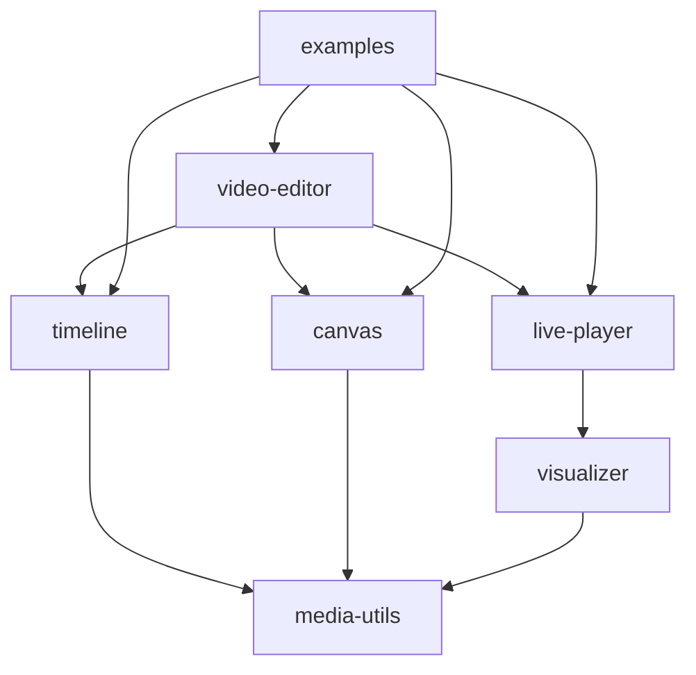
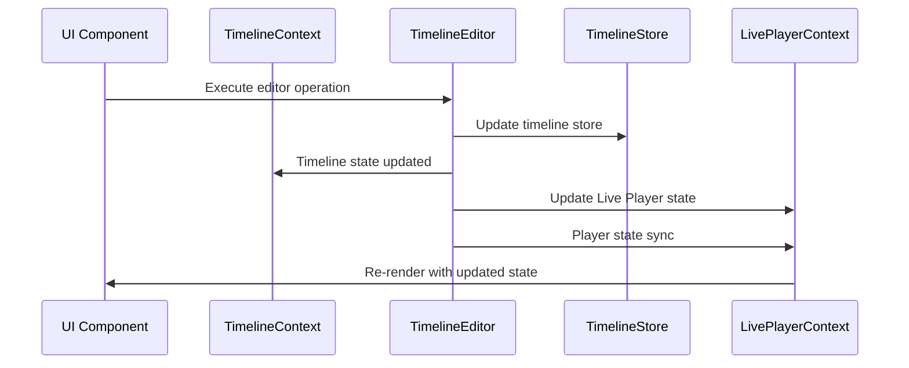
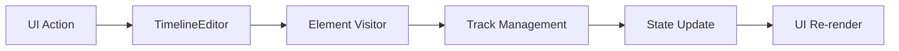
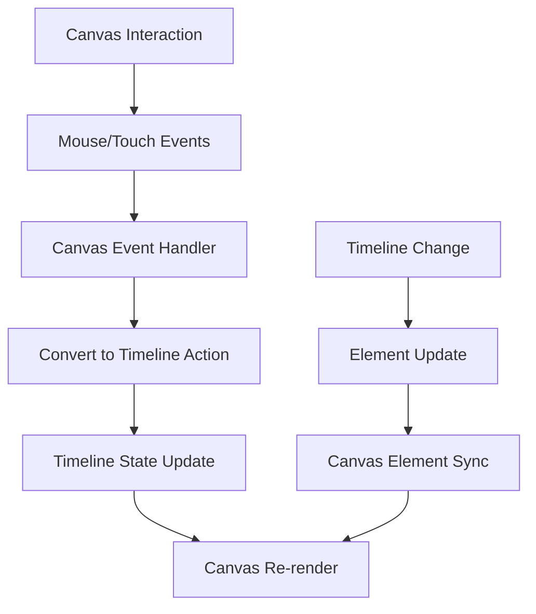
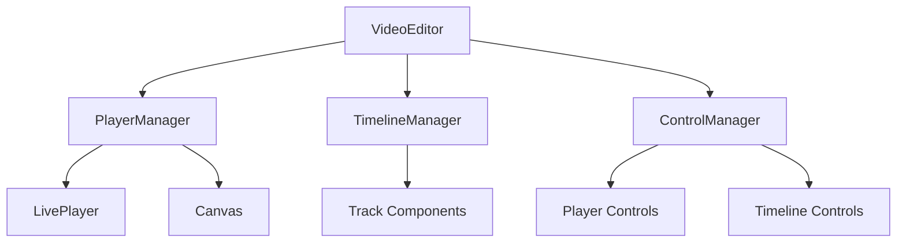
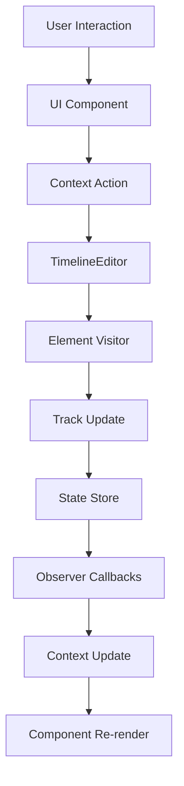
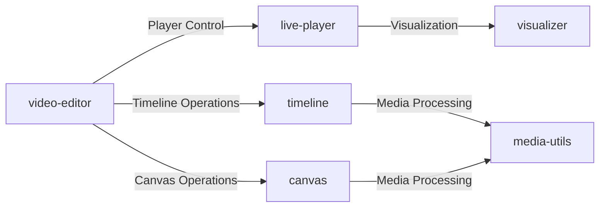

# Twick Architecture

## Overview

Twick is a comprehensive React SDK for building timeline-based video editing applications. It follows a modern, modular architecture with clear separation of concerns across specialized packages. The system is built around **Context Pattern** for state management, **Visitor Pattern** for element operations, and **Observer Pattern** for event handling.

## Package Structure

The project uses a **monorepo architecture** organized into specialized packages:

```
twick/
├── packages/
│   ├── media-utils/         # Core media manipulation utilities
│   ├── canvas/              # Fabric.js-based visual editing canvas
│   ├── timeline/            # Timeline management and operations
│   ├── live-player/         # Video playback and control
│   ├── video-editor/        # High-level video editor component
│   ├── visualizer/          # Video visualization and animation
│   ├── examples/            # Implementation examples
│   └── documentation/       # Documentation site
```

### Package Dependencies



## Core Architecture Patterns

### 1. Context Pattern

The system uses **nested React Context providers** to manage application-wide state and enable communication between components.

#### Timeline Context
```typescript
<TimelineProvider contextId="twick-context-id" initialData={INITIAL_TIMELINE_DATA}>
  <LivePlayerProvider>
    <VideoEditor
          editorConfig={{
            canvasMode: true,
            videoProps: {
              width: 720,
              height: 1280,
            },
          }}
        />
  </LivePlayerProvider>
</TimelineProvider>
```

**`TimelineProvider`** manages:
- Timeline data and operations through `TimelineEditor`
- Selected items and changeLog version 
- Undo/redo functionality
- Change tracking and state synchronization

**`LivePlayerProvider`** manages:
- Player state (playing, paused, seeking)
- Time tracking and duration
- Volume and playback controls
- Synchronization with timeline

#### Context Communication Flow



### 2. Visitor Pattern

Timeline operations follow the **Visitor Pattern** with dedicated visitors for each operation type.

#### Element Visitor System

```typescript
// Base visitor interface
interface ElementVisitor {
  visit(element: TrackElement): boolean | Promise<boolean> | SplitResult;
}

class ElementAdder extends ElementVisitor {
  constructor(private track: Track) {
    this.track = track;
    this.trackFriend = track.createFriend();
  }
  
  async visit(element: TrackElement): Promise<boolean> {
    // Use friend class to access protected methods
    return trackFriend.addElement(element);
  }
}

class ElementRemover extends TrackVisitor {
  constructor(private track: Track) {
    this.track = track;
    this.trackFriend = track.createFriend();
  }
  
  visit(element: TrackElement): boolean {
    // Use friend class to access protected methods
    return trackFriend.removeElement(element);
  }
}

class ElementUpdater extends TrackVisitor {
  constructor(private track: Track) {
    this.track = track;
    this.trackFriend = track.createFriend();
  }
  
  visit(element: TrackElement): boolean {
    // Use friend class to access protected methods
    return trackFriend.updateElement(element);
  }
}

class ElementSplitter implements ElementVisitor {
  constructor(private splitTime: number) {}
  
  visit(element: TrackElement): SplitResult {
    // Split element at specific time logic
    return element.split(splitTime);
  }
}

class ElementCloner implements ElementVisitor {
  visit(element: TrackElement): TrackElement | null {
    // Clone element logic
    return element.clone();
  }
}
```

#### Visitor Operation Flow



**Key Visitors:**
- `ElementAdder` - Add media/text elements to timeline
- `ElementUpdater` - Modify element properties
- `ElementSplitter` - Split audio/video at specific time
- `ElementRemover` - Remove elements from timeline
- `ElementCloner` - Clone existing elements
- `ElementSerializer` - Serialize elements for storage
- `ElementDeserializer` - Deserialize elements from storage
- `ElementValidator` - Validate element data

### 3. Observer Pattern

The system uses **callbacks and event listeners** to observe state changes and coordinate between components.

#### Editor-Level context

```typescript
const editor = new TimelineEditor({
  contextId,
  setTotalDuration,
  setPresent: undoRedoContext.setPresent,
  handleUndo: undoRedoContext.undo,
  handleRedo: undoRedoContext.redo,
  handleResetHistory: undoRedoContext.resetHistory,
  updateChangeLog: updateChangeLog,
  setTimelineAction: (action: string, payload?: unknown) => {
    setTimelineActionState({ type: action, payload });
  },
});
```

#### Canvas Event Observers

```typescript
const handleCanvasOperation = (operation, data) => {
  switch (operation) {
    case CANVAS_OPERATIONS.ITEM_SELECTED:
      setSelectedItem(data); // Propagate selection
      break;
    case CANVAS_OPERATIONS.ITEM_UPDATED:
      setTimelineAction(TIMELINE_ACTION.UPDATE_ELEMENT, {
        updates: data
      });
      break;
  }
};
```

## Timeline Architecture

### TimelineEditor (Core Orchestrator)

The `TimelineEditor` class serves as the central orchestrator for all timeline operations using the Visitor Pattern:

```typescript
export class TimelineEditor {
  private context: TimelineOperationContext;

  constructor(context: TimelineOperationContext) {
    this.context = context;
    timelineContextStore.initializeContext(this.context.contextId);
  }

  // Context and State Management
  getContext(): TimelineOperationContext
  getTimelineData(): TimelineTrackData | null
  getLatestVersion(): number
  pauseVideo(): void
  refresh(): void

  // Track Management
  addTrack(name: string): Track
  getTrackById(id: string): Track | null
  getTrackByName(name: string): Track | null
  removeTrackById(id: string): void
  removeTrack(track: Track): void
  reorderTracks(tracks: Track[]): void

  // Element Management (Visitor Pattern)
  async addElementToTrack(track: Track, element: TrackElement): Promise<boolean>
  removeElement(element: TrackElement): boolean
  updateElement(element: TrackElement): boolean
  async splitElement(element: TrackElement, splitTime: number): Promise<SplitResult>
  cloneElement(element: TrackElement): TrackElement | null

  // History Management
  undo(): void
  redo(): void
  resetHistory(): void

  // Project Management
  loadProject(data: { tracks: TrackJSON[]; version: number }): void

  // Internal Methods
  protected setTimelineData(tracks: Track[], version?: number): TimelineTrackData
  updateHistory(timelineTrackData: TimelineTrackData): void
}
```

### Track-Based Architecture

Timeline data is organized around **Tracks** that contain **TrackElements**. The Track class enforces the Visitor Pattern by making element manipulation methods protected:

```typescript
class TrackFriend {
  constructor(private track: Track) {}
  
  addElement(element: TrackElement): boolean {
    return this.track.addElement(element);
  }
  
  removeElement(element: TrackElement): boolean {
    return this.track.removeElement(element);
  }
  
  updateElement(element: TrackElement): boolean {
    return this.track.updateElement(element);
  }
}

class Track {
  private elements: TrackElement[] = [];
  private name: string;
  private id: string;

  // Public getter methods - safe to call directly
  getElements(): TrackElement[] {
    return [...this.elements]; // Return copy to prevent direct modification
  }
  
  getElementById(id: string): TrackElement | null {
    return this.elements.find(el => el.id === id) || null;
  }
  
  getName(): string {
    return this.name;
  }
  
  getId(): string {
    return this.id;
  }

  // Protected methods - only accessible by TrackFriend
  protected addElement(element: TrackElement): boolean {
    // Validation logic
    if (!this.validateElement(element)) {
      return false;
    }
    
    // Business logic
    this.elements.push(element);
    return true;
  }
  
  protected removeElement(element: TrackElement): boolean {
    const index = this.elements.findIndex(el => el.id === element.id);
    if (index === -1) return false;
    
    this.elements.splice(index, 1);
    return true;
  }
  
  protected updateElement(element: TrackElement): boolean {
    const index = this.elements.findIndex(el => el.id === element.id);
    if (index === -1) return false;
    
    this.elements[index] = element;
    return true;
  }
```

#### Undo/Redo Operations

The TimelineEditor provides comprehensive undo/redo functionality:

```typescript
undo(): void {
  const result = this.context.handleUndo();
  if (result && result.tracks) {
    // Convert JSON back to Track objects
    const tracks = result.tracks.map((t: TrackJSON) => Track.fromJSON(t));
    
    // Update store
    timelineContextStore.setTimelineData(this.context.contextId, {
      tracks,
      version: result.version,
    });

    // Update duration and notify components
    this.context.setTotalDuration(getTotalDuration(result.tracks));
    this.context.updateChangeLog();

    // Trigger timeline action
    if (this.context?.setTimelineAction) {
      this.context.setTimelineAction(TIMELINE_ACTION.UPDATE_PLAYER_DATA, {
        tracks: result.tracks,
        version: result.version,
      });
    }
  }
}

redo(): void {
  const result = this.context.handleRedo();
  if (result && result.tracks) {
    // Convert JSON back to Track objects
    const tracks = result.tracks.map((t: TrackJSON) => Track.fromJSON(t));
    
    // Update store
    timelineContextStore.setTimelineData(this.context.contextId, {
      tracks,
      version: result.version,
    });

    // Update duration and notify components
    this.context.setTotalDuration(getTotalDuration(result.tracks));
    this.context.updateChangeLog();

    // Trigger timeline action
    if (this.context?.setTimelineAction) {
      this.context.setTimelineAction(TIMELINE_ACTION.UPDATE_PLAYER_DATA, {
        tracks: result.tracks,
        version: result.version,
      });
    }
  }
}
```

### Element Types

The system supports multiple element types through inheritance:

```typescript
abstract class TrackElement {
  id: string;
  type: string;
  s: number; // Start time
  e: number; // End time
  timelineId: string;
  props: ElementProps;
  frame?: FrameProps;
}

// Concrete implementations
class VideoElement extends TrackElement
class AudioElement extends TrackElement
class ImageElement extends TrackElement
class TextElement extends TrackElement
class CaptionElement extends TrackElement
class RectElement extends TrackElement
class CircleElement extends TrackElement
class IconElement extends TrackElement
```

## Canvas Architecture

### Fabric.js Integration

The canvas system is built on **Fabric.js** and provides a powerful visual editing interface:

```typescript
// Canvas initialization
const { canvas, canvasMetadata } = createCanvas({
  videoSize: { width: 720, height: 1280 },
  canvasSize: { width: 800, height: 600 },
  canvasRef: canvasElement,
  backgroundColor: "#000000"
});

// Element management
const addElementToCanvas = async ({
  element: CanvasElement,
  index: number,
  reorder: boolean
}) => {
  switch (element.type) {
    case ELEMENT_TYPES.VIDEO:
      await addVideoElement({ element, canvas, canvasMetadata });
      break;
    case ELEMENT_TYPES.IMAGE:
      await addImageElement({ element, canvas, canvasMetadata });
      break;
    case ELEMENT_TYPES.TEXT:
      await addTextElement({ element, canvas, canvasMetadata });
      break;
  }
};
```

### Canvas-Timeline Synchronization



**Key Features:**
- **Real-time Editing**: Direct manipulation of elements on canvas
- **Coordinate Transformation**: Automatic conversion between video and canvas coordinates
- **Element Controls**: Custom Fabric.js controls for resize, rotate, move
- **Z-Index Management**: Proper layering and element ordering
- **Frame Effects**: Support for animations and visual effects

## Video Editor Architecture

### Component Composition

The `VideoEditor` component follows a **composition over inheritance** approach:

```typescript
interface VideoEditorProps {
  leftPanel?: React.ReactNode;
  rightPanel?: React.ReactNode;
  bottomPanel?: React.ReactNode;
  playControls?: React.ReactNode;
  defaultPlayControls?: boolean;
  editorConfig: {
    videoProps: {
      width: number;
      height: number;
    };
    canvasMode?: boolean;
  };
}
```

### Component Structure



## Live Player Architecture

### ReVideo Integration

The live player uses **ReVideo** for high-performance video rendering:

```typescript
// Player initialization
const { LivePlayer } = useLivePlayerContext();

// Player state management
const playerState = {
  isPlaying: boolean;
  currentTime: number;
  duration: number;
  volume: number;
  isMuted: boolean;
};
```

### Player-Timeline Synchronization

```typescript
// Time synchronization
useEffect(() => {
  if (playerState.currentTime !== timelineTime) {
    setTimelineTime(playerState.currentTime);
  }
}, [playerState.currentTime]);

// Playback synchronization
useEffect(() => {
  if (timelineAction.type === TIMELINE_ACTION.SET_PLAYER_STATE) {
    if (timelineAction.payload === PLAYER_STATE.PLAYING) {
      playerRef.current?.play();
    } else if (timelineAction.payload === PLAYER_STATE.PAUSED) {
      playerRef.current?.pause();
    }
  }
}, [timelineAction]);
```

## Visualizer Architecture

### ReVideo Scene Management

The visualizer package uses **ReVideo** for advanced video composition:

```typescript
// Scene creation
const scene = makeScene2D(() => {
  // Scene setup
  const video = createSignal(0);
  const image = createSignal(0);
  
  // Element composition
  const videoElement = createVideoElement(video);
  const imageElement = createImageElement(image);
  
  // Animation and effects
  videoElement.addEffect(blurEffect);
  imageElement.addEffect(fadeEffect);
});
```

### Animation System

```typescript
// Animation types
const ANIMATIONS = {
  BLUR: 'blur',
  BREATHE: 'breathe',
  FADE: 'fade',
  RISE: 'rise',
  SUCCESSION: 'succession'
};

// Text effects
const TEXT_EFFECTS = {
  ELASTIC: 'elastic',
  ERASE: 'erase',
  STREAM_WORD: 'stream-word',
  TYPEWRITER: 'typewriter'
};
```

## Media Utils Architecture

### Core Utilities

The media-utils package provides essential media manipulation functions:

```typescript
// Media metadata
export const getAudioDuration = (file: File): Promise<number>
export const getImageDimensions = (file: File): Promise<Dimensions>
export const getVideoMeta = (file: File): Promise<VideoMeta>
export const getThumbnail = (file: File): Promise<string>

// Dimension handling
export const getObjectFitSize = (container: Dimensions, media: Dimensions): Dimensions
export const getScaledDimensions = (original: Dimensions, maxSize: Dimensions): Dimensions

// File operations
export const downloadFile = (blob: Blob, filename: string): void
export const saveAsFile = (blob: Blob, filename: string): void
export const blobUrlToFile = (blobUrl: string): Promise<File>

// URL utilities
export const detectMediaTypeFromUrl = (url: string): MediaType
```

## Data Flow Architecture

### Unidirectional Data Flow



### State Management

**Timeline State:**
```typescript
interface TimelineTrackData {
  tracks: Track[];
  version: number;
}
```

**Element State:**
```typescript
interface TrackElement {
  id: string;               // Unique identifier
  type: string;             // Element type (video, audio, image, text)
  s: number;                // Start time
  e: number;                // End time
  timelineId: string;       // Parent timeline reference
  props: ElementProps;      // Type-specific properties
  frame?: FrameProps;       // Visual positioning
}
```

## Integration Architecture

### Cross-Package Communication



### Package API Design

```typescript
// Standardized interface for cross-package communication
interface PackageInterface {
  initialize(config: PackageConfig): Promise<void>;
  destroy(): void;
  getState(): PackageState;
  subscribe(event: string, callback: EventCallback): Unsubscribe;
}

// Example: Timeline package API
export const timelineAPI: PackageInterface = {
  async initialize(config: TimelineConfig) {
    timelineService.initialize(config);
  },
  
  destroy() {
    timelineService.dispose();
  },
  
  getState() {
    return timelineService.getTimelineData();
  },
  
  subscribe(event: string, callback: EventCallback) {
    return timelineService.on(event, callback);
  }
};
```

## Validation & Error Handling

### Comprehensive Validation System

```typescript
class ElementValidator implements ElementVisitor {
  visit(element: TrackElement): void {
    this.validateElementId(element.id);
    this.validateElementType(element.type);
    this.validateElementTiming(element.s, element.e);
    this.validateElementProps(element.props);
  }
  
  private validateElementId(id: string): void {
    if (!id || typeof id !== 'string') {
      throw new ValidationError('Invalid element ID');
    }
  }
  
  private validateElementTiming(start: number, end: number): void {
    if (start < 0 || end < 0 || start >= end) {
      throw new ValidationError('Invalid element timing');
    }
  }
}
```

### Error Result Pattern

```typescript
interface ServiceResult<T> {
  success: boolean;
  data?: T;
  error?: string;
  code?: ServiceErrorCode;
  operation?: string;
}
```

## Performance Optimizations

### Efficient Rendering
- **Canvas Optimization**: Fabric.js object pooling and selective rendering
- **Timeline Virtualization**: Only render visible timeline segments
- **Lazy Loading**: Dynamic import of heavy components

### Memory Management
- **Element Cleanup**: Proper disposal of canvas objects
- **Event Listener Cleanup**: Automatic cleanup in useEffect hooks
- **Service Lifecycle**: Singleton pattern for service instances

### Performance Monitoring

```typescript
// Performance tracking utilities
class PerformanceMonitor {
  private metrics = new Map<string, PerformanceEntry>();
  
  startOperation(operationName: string) {
    performance.mark(`${operationName}-start`);
  }
  
  endOperation(operationName: string) {
    performance.mark(`${operationName}-end`);
    performance.measure(
      operationName,
      `${operationName}-start`,
      `${operationName}-end`
    );
    
    const entry = performance.getEntriesByName(operationName)[0];
    this.metrics.set(operationName, entry);
    
    // Log slow operations
    if (entry.duration > 100) {
      console.warn(`Slow operation detected: ${operationName} took ${entry.duration}ms`);
    }
  }
}
```

## Extensibility

### Plugin Architecture
- **Element Visitors**: Easy addition of new timeline operations
- **Element Types**: Support for custom element types
- **Validation Rules**: Extensible validation system
- **Canvas Controls**: Custom Fabric.js controls and interactions

### API Design
- **Consistent Interfaces**: All services follow similar patterns
- **Type Safety**: Full TypeScript support throughout
- **Hook Composition**: Reusable custom hooks for common operations
- **Context Flexibility**: Multiple context providers for different concerns

### Plugin System Implementation

```typescript
// Plugin interface
interface TwickPlugin {
  name: string;
  version: string;
  initialize(api: TwickAPI): Promise<void>;
  destroy(): void;
}

// Plugin registry
class PluginManager {
  private plugins = new Map<string, TwickPlugin>();
  private api: TwickAPI;
  
  constructor(api: TwickAPI) {
    this.api = api;
  }
  
  async registerPlugin(plugin: TwickPlugin) {
    if (this.plugins.has(plugin.name)) {
      throw new Error(`Plugin ${plugin.name} already registered`);
    }
    
    await plugin.initialize(this.api);
    this.plugins.set(plugin.name, plugin);
  }
  
  unregisterPlugin(name: string) {
    const plugin = this.plugins.get(name);
    if (plugin) {
      plugin.destroy();
      this.plugins.delete(name);
    }
  }
}
```

## Development Workflow

### Development Environment Setup

```bash
# Install dependencies
pnpm install

# Build all packages
pnpm build

# Run development servers
pnpm dev

# Run specific package in development
pnpm dev:timeline
pnpm dev:canvas
pnpm dev:video-editor

# Run linting
pnpm lint

# Preview examples
pnpm preview
```

### Package Development Workflow

```typescript
// 1. Create feature branch
git checkout -b feature/new-timeline-operation

// 2. Implement feature in appropriate package
// packages/timeline/src/visitors/new-element-visitor.ts

// 3. Add tests
// packages/timeline/tests/visitors/new-element-visitor.test.ts

// 4. Update examples if needed
// packages/examples/src/components/new-feature-demo.tsx

// 5. Build and test
pnpm build:timeline
pnpm test:timeline

// 6. Create pull request
```

### Code Organization Best Practices

```typescript
// File naming conventions
timeline/
├── src/
│   ├── components/          # React components
│   │   ├── timeline/        # Timeline-specific components
│   │   └── controls/        # Control components
│   ├── hooks/               # Custom React hooks
│   ├── core/                # Core business logic
│   │   ├── editor/          # Timeline editor
│   │   ├── elements/        # Element implementations
│   │   ├── track/           # Track management
│   │   └── visitor/         # Element visitors
│   ├── context/             # React contexts
│   ├── services/            # Data services
│   ├── types/               # TypeScript type definitions
│   ├── utils/               # Utility functions
│   └── index.ts             # Public API exports
```

## Testing Architecture

### Testing Strategy

```typescript
// Unit test structure for visitors
describe('ElementAdder', () => {
  let elementAdder: ElementAdder;
  let mockTrack: jest.Mocked<Track>;
  
  beforeEach(() => {
    mockTrack = createMockTrack();
    elementAdder = new ElementAdder(mockTrack);
  });
  
  describe('visit', () => {
    it('should add element to track', async () => {
      const element = createTestElement();
      
      const result = await elementAdder.visit(element);
      
      expect(mockTrack.addElement).toHaveBeenCalledWith(element);
      expect(result).toBe(true);
    });
    
    it('should return false for invalid element', async () => {
      const invalidElement = createInvalidElement();
      mockTrack.addElement.mockReturnValue(false);
      
      const result = await elementAdder.visit(invalidElement);
      
      expect(result).toBe(false);
    });
  });
});

// TimelineEditor integration tests
describe('TimelineEditor Integration', () => {
  let timelineEditor: TimelineEditor;
  let mockContext: TimelineOperationContext;
  
  beforeEach(async () => {
    mockContext = createMockContext();
    timelineEditor = new TimelineEditor(mockContext);
  });
  
  it('should execute add element operation end-to-end', async () => {
    const track = timelineEditor.addTrack('Test Track');
    const element = createTestElement();
    
    const result = await timelineEditor.addElementToTrack(track, element);
    
    expect(result).toBe(true);
    expect(track.getElements()).toHaveLength(1);
  });
  
  it('should handle undo/redo operations', () => {
    const track = timelineEditor.addTrack('Test Track');
    const element = createTestElement();
    
    // Add element
    timelineEditor.addElementToTrack(track, element);
    expect(track.getElements()).toHaveLength(1);
    
    // Undo
    timelineEditor.undo();
    expect(track.getElements()).toHaveLength(0);
    
    // Redo
    timelineEditor.redo();
    expect(track.getElements()).toHaveLength(1);
  });
});

// Integration test for timeline operations
describe('TimelineEditor Integration', () => {
  let timelineEditor: TimelineEditor;
  let mockContext: TimelineOperationContext;
  
  beforeEach(async () => {
    mockContext = createMockContext();
    timelineEditor = new TimelineEditor(mockContext);
  });
  
  it('should execute add element operation end-to-end', async () => {
    const track = timelineEditor.addTrack('Test Track');
    const element = createTestElement();
    
    const result = await timelineEditor.addElementToTrack(track.id, element);
    
    expect(result).toBe(true);
    expect(track.getElements()).toHaveLength(1);
  });
});
```

## Deployment & Production

### Build Process

```typescript
// vite.config.ts - Standard configuration across packages
export default defineConfig({
  build: {
    lib: {
      entry: './src/index.ts',
      name: 'TwickPackage',
      formats: ['es', 'cjs']
    },
    rollupOptions: {
      external: ['react', 'react-dom'],
      output: {
        globals: {
          react: 'React',
          'react-dom': 'ReactDOM'
        }
      }
    }
  },
  plugins: [
    react(),
    dts() // Generate TypeScript declarations
  ]
});
```

### Production Considerations

```typescript
// Production optimizations
class ProductionOptimizations {
  // Lazy loading for heavy components
  static lazy = {
    VideoEditor: React.lazy(() => import('@twick/video-editor')),
    Visualizer: React.lazy(() => import('@twick/visualizer')),
    Timeline: React.lazy(() => import('@twick/timeline'))
  };
  
  // Performance monitoring
  static enablePerformanceTracking() {
    if (process.env.NODE_ENV === 'production') {
      PerformanceMonitor.initialize({
        endpoint: '/api/metrics',
        sampleRate: 0.1 // Sample 10% of operations
      });
    }
  }
}
```

## Troubleshooting & Debugging

### Common Issues and Solutions

#### Canvas Not Rendering
```typescript
// Debug canvas initialization
const debugCanvas = () => {
  console.log('Canvas ref:', canvasRef.current);
  console.log('Container dimensions:', container.getBoundingClientRect());
  console.log('Video size:', videoSize);
  console.log('Canvas metadata:', canvasMetadata);
  
  // Check for common issues
  if (!canvasRef.current) {
    console.error('Canvas ref is null - ensure ref is attached');
  }
  
  if (videoSize.width === 0 || videoSize.height === 0) {
    console.error('Invalid video dimensions');
  }
};
```

#### Timeline Operations Not Executing
```typescript
// Debug operation flow
const debugTimelineOperation = (operation) => {
  console.log('Operation dispatched:', operation);
  
  // Check visitor registry
  const visitor = getVisitorForOperation(operation.type);
  if (!visitor) {
    console.error(`No visitor found for operation: ${operation.type}`);
    return;
  }
  
  // Check operation context
  console.log('Operation context:', operationContext);
  
  // Validate payload
  try {
    validateOperationPayload(operation.type, operation.payload);
    console.log('Payload validation passed');
  } catch (error) {
    console.error('Payload validation failed:', error);
  }
};
```

## Migration & Upgrade Guide

### Version Compatibility

```typescript
// Version compatibility checking
class CompatibilityChecker {
  static checkVersion(packageVersion: string, requiredVersion: string): boolean {
    return semver.gte(packageVersion, requiredVersion);
  }
  
  static validatePackageCompatibility() {
    const packages = {
      '@twick/timeline': require('@twick/timeline/package.json').version,
      '@twick/canvas': require('@twick/canvas/package.json').version,
      '@twick/live-player': require('@twick/live-player/package.json').version
    };
    
    // Check for compatibility issues
    Object.entries(packages).forEach(([name, version]) => {
      if (!this.checkVersion(version, MINIMUM_VERSIONS[name])) {
        console.warn(`${name} version ${version} may not be compatible`);
      }
    });
  }
}
```

## Contributing Guidelines

### Code Standards

```typescript
// ESLint configuration example
module.exports = {
  extends: [
    '@typescript-eslint/recommended',
    'plugin:react/recommended',
    'plugin:react-hooks/recommended'
  ],
  rules: {
    // Naming conventions
    '@typescript-eslint/naming-convention': [
      'error',
      {
        selector: 'interface',
        format: ['PascalCase']
      },
      {
        selector: 'typeAlias',
        format: ['PascalCase']
      },
      {
        selector: 'enum',
        format: ['PascalCase']
      }
    ],
    
    // Code quality
    'prefer-const': 'error',
    'no-var': 'error',
    '@typescript-eslint/no-unused-vars': 'error',
    
    // React specific
    'react/prop-types': 'off', // Using TypeScript instead
    'react-hooks/exhaustive-deps': 'warn'
  }
};
```

### Pull Request Guidelines

```markdown
## Pull Request Template

### Description
Brief description of changes

### Type of Change
- [ ] Bug fix
- [ ] New feature
- [ ] Breaking change
- [ ] Documentation update

### Testing
- [ ] Unit tests added/updated
- [ ] Integration tests added/updated
- [ ] Manual testing completed

### Checklist
- [ ] Code follows style guidelines
- [ ] Self-review completed
- [ ] Documentation updated
- [ ] Breaking changes documented
```

### Release Process

```bash
# 1. Version bump using changesets
pnpm changeset

# 2. Build all packages
pnpm build

# 3. Run full test suite
pnpm test

# 4. Update documentation
pnpm docs:build

# 5. Create release
pnpm changeset version
pnpm changeset publish
```

## Summary

Twick's architecture provides:

1. **Modularity**: Clear package boundaries with specific responsibilities
2. **Scalability**: Context + Visitor + Observer patterns for complex state management
3. **Flexibility**: Canvas-based editing with timeline synchronization
4. **Reliability**: Comprehensive validation and error handling
5. **Performance**: Optimized rendering and efficient state updates
6. **Developer Experience**: Strong typing, consistent APIs, and extensible design
7. **Production Ready**: Performance monitoring, error reporting, and debugging tools
8. **Maintainable**: Comprehensive testing, documentation, and migration strategies

The architecture successfully separates presentation (Canvas, UI), business logic (Editor, Visitors), and state management (Context, Observers), creating a maintainable and scalable video editing platform that can be extended and customized for various use cases. 