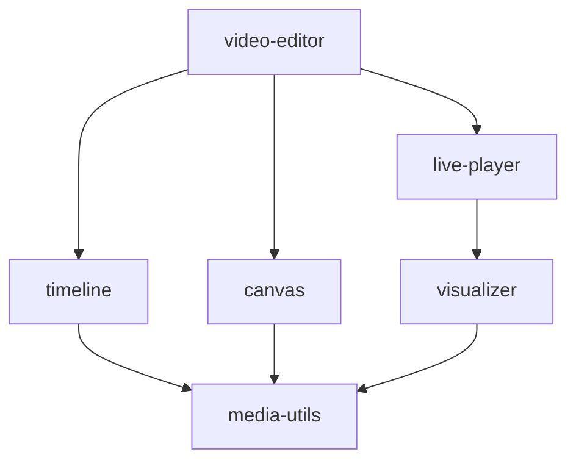
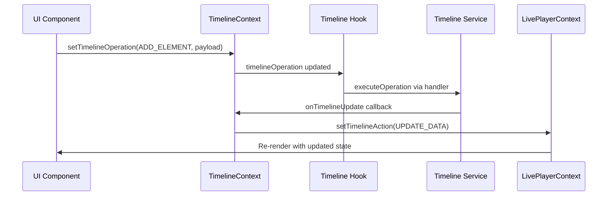
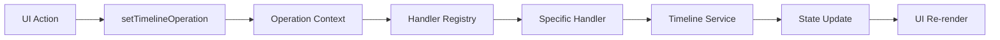
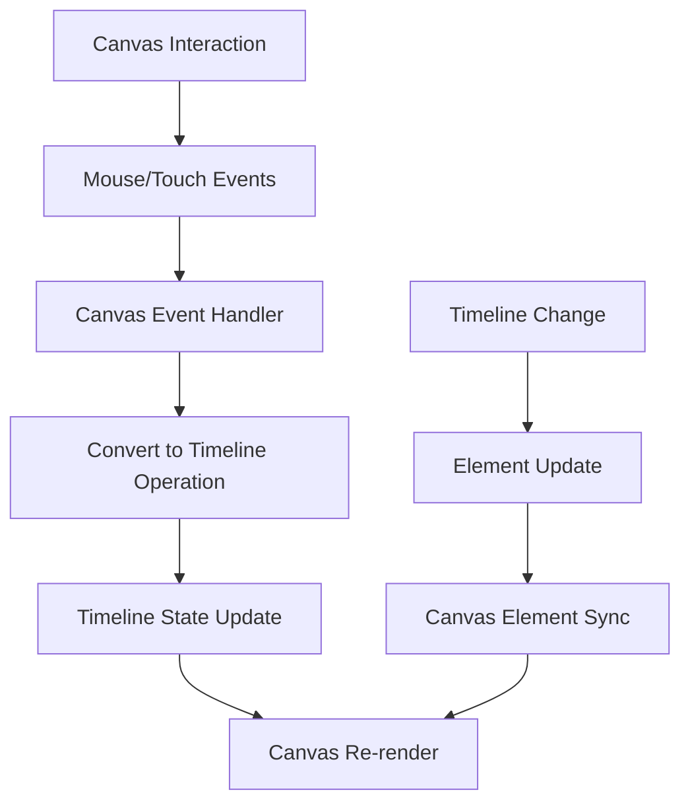
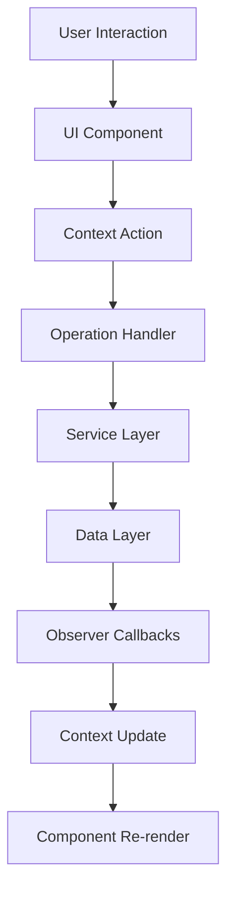
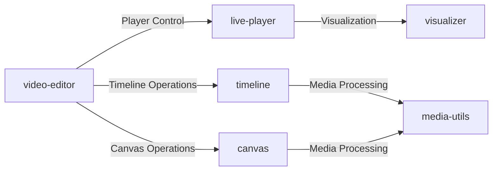

# Twick Architecture

## Overview

Twick is a modular React SDK for building timeline-based video editing applications. It follows a modern, scalable architecture with clear separation of concerns across multiple packages. The system is designed around three core patterns: **Context Pattern** for state management, **Command Pattern** for operations, and **Observer Pattern** for event handling.

## Package Structure

The project uses a **monorepo architecture** organized into specialized packages:

```
twick/
├── packages/
│   ├── media-utils/         # Core media manipulation utilities
│   ├── canvas/              # Fabric.js-based visual editing canvas
│   ├── timeline/            # Timeline management and operations
│   ├── live-player/         # Video playback and control
│   ├── video-editor/        # High-level video editor component
│   ├── visualizer/          # Video visualization and animation
│   └── examples/            # Implementation examples
```

### Package Dependencies



## Core Architecture Patterns

### 1. Context Pattern

The system uses **nested React Context providers** to manage application-wide state and enable communication between components.

#### Timeline Context
```typescript
<TimelineProvider initialData={{ timeline: [], version: 0 }}>
  <LivePlayerProvider>
    <VideoEditor />
  </LivePlayerProvider>
</TimelineProvider>
```

**`TimelineProvider`** manages:
- Timeline data and operations
- Selected items and project versions
- Operation results and error handling
- Command dispatching through `setTimelineOperation`

**`LivePlayerProvider`** manages:
- Player state (playing, paused, seeking)
- Time tracking and duration
- Volume and playback controls
- Synchronization with timeline

#### Context Communication Flow



### 2. Command Pattern

Timeline operations follow the **Command Pattern** with dedicated operation handlers for each command type.

#### Operation Handler System

```typescript
interface TimelineOperationHandler {
  execute(payload: any, context: TimelineOperationContext): void | Promise<void>;
}

const OperationHandlers: Record<string, TimelineOperationHandler> = {
  [TIMELINE_OPERATION.ADD_ELEMENT]: new AddElementHandler(),
  [TIMELINE_OPERATION.UPDATE_ELEMENT]: new UpdateElementHandler(),
  [TIMELINE_OPERATION.DELETE_ITEM]: new DeleteItemHandler(),
  [TIMELINE_OPERATION.SPLIT_ELEMENT]: new SplitElementHandler(),
  // ... more handlers
};
```

#### Command Execution Flow



**Key Commands:**
- `ADD_ELEMENT` - Add media/text elements to timeline
- `UPDATE_ELEMENT` - Modify element properties
- `SPLIT_ELEMENT` - Split audio/video at specific time
- `DELETE_ITEM` - Remove elements or timelines
- `LOAD_PROJECT` - Import complete project data

### 3. Observer Pattern

The system uses **callbacks and event listeners** to observe state changes and coordinate between components.

#### Service-Level Observers

```typescript
timelineService.initialize({
  videoSize: { width: 1920, height: 1080 },
  onTimelineUpdate: (timelineData) => {
    // Observer: React to timeline changes
    setTimelineData(timelineData);
    setTimelineAction(TIMELINE_ACTION.SET_PRESENT, timelineData);
  },
  onSelectionChange: (item) => {
    // Observer: React to selection changes
    setSelectedItem(item);
  }
});
```

#### Canvas Event Observers

```typescript
const handleCanvasOperation = (operation, data) => {
  switch (operation) {
    case CANVAS_OPERATIONS.ITEM_SELECTED:
      setSelectedItem(data); // Propagate selection
      break;
    case CANVAS_OPERATIONS.ITEM_UPDATED:
      setTimelineOperation(TIMELINE_OPERATION.UPDATE_ELEMENT, {
        // Convert canvas changes to timeline operations
        updates: data
      });
      break;
  }
};
```

## Canvas Architecture

### Fabric.js Integration

The canvas system is built on **Fabric.js** and provides a powerful visual editing interface:

```typescript
// Canvas initialization
const { canvas, canvasMetadata } = createCanvas({
  videoSize: { width: 720, height: 1280 },
  canvasSize: { width: 800, height: 600 },
  canvasRef: canvasElement,
  backgroundColor: "#000000"
});

// Element management
const addElementToCanvas = async ({
  element: CanvasElement,
  index: number,
  reorder: boolean
}) => {
  switch (element.type) {
    case ELEMENT_TYPES.VIDEO:
      await addVideoElement({ element, canvas, canvasMetadata });
      break;
    case ELEMENT_TYPES.IMAGE:
      await addImageElement({ element, canvas, canvasMetadata });
      break;
    case ELEMENT_TYPES.TEXT:
      await addTextElement({ element, canvas, canvasMetadata });
      break;
  }
};
```

### Canvas-Timeline Synchronization



**Key Features:**
- **Real-time Editing**: Direct manipulation of elements on canvas
- **Coordinate Transformation**: Automatic conversion between video and canvas coordinates
- **Element Controls**: Custom Fabric.js controls for resize, rotate, move
- **Z-Index Management**: Proper layering and element ordering
- **Frame Effects**: Support for animations and visual effects

### Canvas Element Lifecycle

```typescript
// Element creation and management
class CanvasElementManager {
  private elementMap = new Map<string, FabricObject>();
  
  async addElement(element: CanvasElement) {
    // Validate element
    ValidationHelper.validateCanvasElement(element);
    
    // Create fabric object based on type
    const fabricObject = await this.createFabricObject(element);
    
    // Configure object properties
    this.configureFabricObject(fabricObject, element);
    
    // Add to canvas and track
    this.canvas.add(fabricObject);
    this.elementMap.set(element.id, fabricObject);
    
    // Setup event listeners
    this.setupElementEvents(fabricObject, element);
  }
  
  private setupElementEvents(object: FabricObject, element: CanvasElement) {
    object.on('modified', () => {
      const updates = this.extractUpdates(object, element);
      this.onElementUpdate(element.id, updates);
    });
    
    object.on('selected', () => {
      this.onElementSelect(element);
    });
  }
}
```

## Service Layer Architecture

### Timeline Service (Singleton)

The `TimelineService` follows the **Composite Pattern**, orchestrating multiple internal services:

```typescript
export class TimelineService {
  private dataService: TimelineDataService;      // Data persistence
  private elementService: ElementService;        // Element CRUD operations
  private animationService: AnimationService;    // Animation management
  private captionService: CaptionService;        // Caption handling

  // Facade methods that delegate to appropriate services
  async addElement(options) {
    return this.elementService.addElement(options);
  }
  
  editElement(options) {
    return this.elementService.editElement(options);
  }
}
```

### Service Responsibilities

#### TimelineDataService
- **State Management**: Timeline and element data storage
- **Version Control**: Project versioning and change tracking
- **Data Validation**: Ensures data integrity
- **Event Broadcasting**: Notifies observers of changes

#### ElementService
- **Element Lifecycle**: Create, update, delete timeline elements
- **Validation**: Input validation for all element operations
- **Type Handling**: Support for video, audio, image, text elements
- **Error Management**: Comprehensive error handling with typed results

#### AnimationService & CaptionService
- **Specialized Operations**: Domain-specific functionality
- **Integration**: Seamless integration with core timeline operations

### Service Communication Pattern

```typescript
// Service collaboration example
class ElementService {
  constructor(
    private dataService: TimelineDataService,
    private getConfig: () => TimelineConfig
  ) {}
  
  async addElement(options: AddElementOptions) {
    // Validate through ValidationHelper
    ValidationHelper.validateAddElementOptions(options);
    
    // Get configuration from injected function
    const config = this.getConfig();
    
    // Create element using factory pattern
    const element = await this.createElement(options, config);
    
    // Persist through data service
    const result = this.dataService.addElementToTimeline(
      options.timelineId, 
      element
    );
    
    // Return structured result
    return result;
  }
}
```

## Data Flow Architecture

### Unidirectional Data Flow



### State Management

**Timeline State:**
```typescript
interface TimelineData {
  timeline: Timeline[];      // Array of timeline tracks
  version: number;          // For optimistic updates
  elements: TimelineElement[]; // All timeline elements
}
```

**Element State:**
```typescript
interface TimelineElement {
  id: string;               // Unique identifier
  type: string;             // Element type (video, audio, image, text)
  s: number;                // Start time
  e: number;                // End time
  timelineId: string;       // Parent timeline reference
  props: ElementProps;      // Type-specific properties
  frame?: FrameProps;       // Visual positioning
}
```

### State Synchronization Strategies

```typescript
// Optimistic updates with rollback capability
class StateManager {
  private currentState: TimelineData;
  private pendingOperations = new Map<string, PendingOperation>();
  
  async executeOperation(operation: TimelineOperation) {
    const operationId = generateId();
    
    // Store pending operation for potential rollback
    this.pendingOperations.set(operationId, {
      operation,
      previousState: this.cloneState(this.currentState)
    });
    
    try {
      // Apply optimistic update
      const optimisticState = this.applyOptimisticUpdate(operation);
      this.updateUI(optimisticState);
      
      // Execute actual operation
      const result = await this.executeRemoteOperation(operation);
      
      // Confirm or rollback based on result
      if (result.success) {
        this.confirmOperation(operationId, result.data);
      } else {
        this.rollbackOperation(operationId);
      }
    } catch (error) {
      this.rollbackOperation(operationId);
      throw error;
    }
  }
}
```

## Integration Architecture

### Component Composition

The system follows a **composition over inheritance** approach:

```typescript
// High-level composition
<LivePlayerProvider>
  <TimelineProvider>
    <VideoEditor
      leftPanel={<EditorControls />}
      rightPanel={<MediaPanel />}
      editorConfig={{
        videoProps: { width: 720, height: 1280 },
        canvasMode: true
      }}
    />
  </TimelineProvider>
</LivePlayerProvider>
```

### Cross-Package Communication



### Inter-Package API Design

```typescript
// Standardized interface for cross-package communication
interface PackageInterface {
  initialize(config: PackageConfig): Promise<void>;
  destroy(): void;
  getState(): PackageState;
  subscribe(event: string, callback: EventCallback): Unsubscribe;
}

// Example: Timeline package API
export const timelineAPI: PackageInterface = {
  async initialize(config: TimelineConfig) {
    timelineService.initialize(config);
  },
  
  destroy() {
    timelineService.dispose();
  },
  
  getState() {
    return timelineService.getTimelineData();
  },
  
  subscribe(event: string, callback: EventCallback) {
    return timelineService.on(event, callback);
  }
};
```

## Validation & Error Handling

### Comprehensive Validation System

```typescript
class ValidationHelper {
  // Element creation validation
  static validateCreateImageElement(params) {
    this.validateCreateElementParams(params);
    this.validateVideoSize(params.videoSize);
    this.validateImageElementProps(params.props);
  }
  
  // Operation validation
  static validateSplitOperation(elementId, splitTime, element) {
    this.validateElementId(elementId);
    if (!canSplitElement(element)) {
      throw new TimelineServiceError('Split not supported for this element type');
    }
  }
}
```

### Error Result Pattern

```typescript
interface ServiceResult<T> {
  success: boolean;
  data?: T;
  error?: string;
  code?: ServiceErrorCode;
  operation?: string;
}
```

### Error Boundary Implementation

```typescript
class TwickErrorBoundary extends React.Component {
  constructor(props) {
    super(props);
    this.state = { hasError: false, error: null };
  }
  
  static getDerivedStateFromError(error) {
    return { hasError: true, error };
  }
  
  componentDidCatch(error, errorInfo) {
    // Log error to monitoring service
    ErrorReporting.logError(error, errorInfo);
    
    // Attempt recovery
    this.attemptRecovery(error);
  }
  
  attemptRecovery(error) {
    if (error instanceof TimelineServiceError) {
      // Timeline-specific recovery
      timelineService.reset();
    } else if (error instanceof CanvasError) {
      // Canvas-specific recovery
      canvasService.reinitialize();
    }
  }
}
```

## Performance Optimizations

### Efficient Rendering
- **Canvas Optimization**: Fabric.js object pooling and selective rendering
- **Timeline Virtualization**: Only render visible timeline segments
- **Lazy Loading**: Dynamic import of heavy components

### Memory Management
- **Element Cleanup**: Proper disposal of canvas objects
- **Event Listener Cleanup**: Automatic cleanup in useEffect hooks
- **Service Lifecycle**: Singleton pattern for service instances

### Performance Monitoring

```typescript
// Performance tracking utilities
class PerformanceMonitor {
  private metrics = new Map<string, PerformanceEntry>();
  
  startOperation(operationName: string) {
    performance.mark(`${operationName}-start`);
  }
  
  endOperation(operationName: string) {
    performance.mark(`${operationName}-end`);
    performance.measure(
      operationName,
      `${operationName}-start`,
      `${operationName}-end`
    );
    
    const entry = performance.getEntriesByName(operationName)[0];
    this.metrics.set(operationName, entry);
    
    // Log slow operations
    if (entry.duration > 100) {
      console.warn(`Slow operation detected: ${operationName} took ${entry.duration}ms`);
    }
  }
}

// Usage in timeline operations
const performanceMonitor = new PerformanceMonitor();

class AddElementHandler {
  async execute(payload, context) {
    performanceMonitor.startOperation('add-element');
    
    try {
      const result = await this.addElement(payload);
      return result;
    } finally {
      performanceMonitor.endOperation('add-element');
    }
  }
}
```

## Extensibility

### Plugin Architecture
- **Operation Handlers**: Easy addition of new timeline operations
- **Element Types**: Support for custom element types
- **Validation Rules**: Extensible validation system
- **Canvas Controls**: Custom Fabric.js controls and interactions

### API Design
- **Consistent Interfaces**: All services follow similar patterns
- **Type Safety**: Full TypeScript support throughout
- **Hook Composition**: Reusable custom hooks for common operations
- **Context Flexibility**: Multiple context providers for different concerns

### Plugin System Implementation

```typescript
// Plugin interface
interface TwickPlugin {
  name: string;
  version: string;
  initialize(api: TwickAPI): Promise<void>;
  destroy(): void;
}

// Plugin registry
class PluginManager {
  private plugins = new Map<string, TwickPlugin>();
  private api: TwickAPI;
  
  constructor(api: TwickAPI) {
    this.api = api;
  }
  
  async registerPlugin(plugin: TwickPlugin) {
    if (this.plugins.has(plugin.name)) {
      throw new Error(`Plugin ${plugin.name} already registered`);
    }
    
    await plugin.initialize(this.api);
    this.plugins.set(plugin.name, plugin);
  }
  
  unregisterPlugin(name: string) {
    const plugin = this.plugins.get(name);
    if (plugin) {
      plugin.destroy();
      this.plugins.delete(name);
    }
  }
}

// Example plugin
class CustomElementPlugin implements TwickPlugin {
  name = "custom-element-plugin";
  version = "1.0.0";
  
  async initialize(api: TwickAPI) {
    // Register custom element type
    api.timeline.registerElementType('custom', {
      create: this.createElement,
      validate: this.validateElement,
      render: this.renderElement
    });
    
    // Register custom canvas controls
    api.canvas.registerControls('custom', CustomControls);
  }
  
  destroy() {
    // Cleanup plugin resources
  }
}
```

## Testing Architecture

### Testing Strategy

```typescript
// Unit test structure for services
describe('ElementService', () => {
  let elementService: ElementService;
  let mockDataService: jest.Mocked<TimelineDataService>;
  
  beforeEach(() => {
    mockDataService = createMockDataService();
    elementService = new ElementService(mockDataService, () => mockConfig);
  });
  
  describe('addElement', () => {
    it('should validate input before creating element', async () => {
      const options = createValidAddElementOptions();
      
      await elementService.addElement(options);
      
      expect(ValidationHelper.validateAddElementOptions).toHaveBeenCalledWith(options);
    });
    
    it('should throw validation error for invalid input', async () => {
      const invalidOptions = createInvalidAddElementOptions();
      
      await expect(elementService.addElement(invalidOptions))
        .rejects.toThrow(TimelineServiceError);
    });
  });
});

// Integration test for timeline operations
describe('Timeline Operations Integration', () => {
  let timelineService: TimelineService;
  let operationContext: TimelineOperationContext;
  
  beforeEach(async () => {
    timelineService = new TimelineService();
    await timelineService.initialize(testConfig);
    operationContext = createTestOperationContext();
  });
  
  it('should execute add element operation end-to-end', async () => {
    const operation = {
      type: TIMELINE_OPERATION.ADD_ELEMENT,
      payload: createElementPayload()
    };
    
    await executeTimelineOperation(operation, operationContext);
    
    const timeline = timelineService.getTimelineData();
    expect(timeline.elements).toHaveLength(1);
  });
});
```

### Test Utilities

```typescript
// Test factory functions
export const TestFactories = {
  createTimelineElement(overrides?: Partial<TimelineElement>): TimelineElement {
    return {
      id: 'e-test-id',
      type: 'image',
      s: 0,
      e: 5,
      timelineId: 't-test-timeline',
      props: { src: 'test.jpg' },
      ...overrides
    };
  },
  
  createTimeline(overrides?: Partial<Timeline>): Timeline {
    return {
      id: 't-test-timeline',
      type: 'video',
      name: 'Test Timeline',
      elements: [],
      ...overrides
    };
  },
  
  createCanvasElement(overrides?: Partial<CanvasElement>): CanvasElement {
    return {
      id: 'e-canvas-test',
      type: 'image',
      props: { src: 'test.jpg', x: 0, y: 0 },
      ...overrides
    };
  }
};

// Mock implementations
export const createMockTimelineService = (): jest.Mocked<TimelineService> => {
  return {
    initialize: jest.fn(),
    addElement: jest.fn(),
    editElement: jest.fn(),
    deleteElement: jest.fn(),
    getTimelineData: jest.fn(),
    getTotalDuration: jest.fn()
  };
};
```

## Development Workflow

### Development Environment Setup

```bash
# Install dependencies
pnpm install

# Build all packages
pnpm build

# Run development servers
pnpm dev

# Run specific package in development
pnpm dev:timeline
pnpm dev:canvas
pnpm dev:video-editor

# Run tests
pnpm test

# Run linting
pnpm lint

# Preview examples
pnpm preview
```

### Package Development Workflow

```typescript
// 1. Create feature branch
git checkout -b feature/new-timeline-operation

// 2. Implement feature in appropriate package
// packages/timeline/src/operations/new-operation.ts

// 3. Add tests
// packages/timeline/tests/operations/new-operation.test.ts

// 4. Update examples if needed
// packages/examples/src/components/new-feature-demo.tsx

// 5. Build and test
pnpm build:timeline
pnpm test:timeline

// 6. Create pull request
```

### Code Organization Best Practices

```typescript
// File naming conventions
timeline/
├── src/
│   ├── components/          # React components
│   │   ├── timeline/        # Timeline-specific components
│   │   └── controls/        # Control components
│   ├── hooks/               # Custom React hooks
│   ├── services/            # Business logic services
│   │   ├── timeline/        # Timeline service
│   │   ├── element/         # Element service
│   │   └── animation/       # Animation service
│   ├── types/               # TypeScript type definitions
│   │   ├── component.types.ts
│   │   ├── service.types.ts
│   │   └── result.types.ts
│   ├── utils/               # Utility functions
│   │   ├── validation.ts
│   │   ├── constants.ts
│   │   └── timeline.utils.ts
│   └── index.ts             # Public API exports
```

### API Design Guidelines

```typescript
// 1. Consistent naming patterns
interface ServiceInterface {
  // Verbs for actions
  addElement(options: AddElementOptions): Promise<ServiceResult<TimelineElement>>;
  updateElement(id: string, updates: Partial<TimelineElement>): ServiceResult<TimelineElement>;
  deleteElement(id: string): ServiceResult<void>;
  
  // Get prefix for data retrieval
  getElement(id: string): TimelineElement | undefined;
  getTimeline(id: string): Timeline | undefined;
  
  // Is/Has prefix for boolean checks
  isElementSelected(id: string): boolean;
  hasUnsavedChanges(): boolean;
}

// 2. Consistent error handling
class ServiceMethod {
  async execute(): Promise<ServiceResult<T>> {
    try {
      const result = await this.performOperation();
      return serviceResultSuccess({ data: result });
    } catch (error) {
      if (error instanceof ValidationError) {
        return serviceResultError({
          error: error.message,
          code: ServiceErrorCode.VALIDATION_FAILED
        });
      }
      throw error; // Re-throw unexpected errors
    }
  }
}

// 3. Type-safe configurations
interface PackageConfig {
  readonly required: RequiredConfig;
  readonly optional?: OptionalConfig;
}

interface RequiredConfig {
  videoSize: { width: number; height: number };
}

interface OptionalConfig {
  backgroundColor?: string;
  autoSave?: boolean;
  maxUndoSteps?: number;
}
```

## Deployment & Production

### Build Process

```typescript
// vite.config.ts - Standard configuration across packages
export default defineConfig({
  build: {
    lib: {
      entry: './src/index.ts',
      name: 'TwickPackage',
      formats: ['es', 'cjs']
    },
    rollupOptions: {
      external: ['react', 'react-dom'],
      output: {
        globals: {
          react: 'React',
          'react-dom': 'ReactDOM'
        }
      }
    }
  },
  plugins: [
    react(),
    dts() // Generate TypeScript declarations
  ]
});
```

### Production Considerations

```typescript
// Production optimizations
class ProductionOptimizations {
  // Lazy loading for heavy components
  static lazy = {
    VideoEditor: React.lazy(() => import('@twick/video-editor')),
    Visualizer: React.lazy(() => import('@twick/visualizer')),
    Timeline: React.lazy(() => import('@twick/timeline'))
  };
  
  // Performance monitoring
  static enablePerformanceTracking() {
    if (process.env.NODE_ENV === 'production') {
      // Enable production performance tracking
      PerformanceMonitor.initialize({
        endpoint: '/api/metrics',
        sampleRate: 0.1 // Sample 10% of operations
      });
    }
  }
  
  // Error reporting
  static enableErrorReporting() {
    window.addEventListener('unhandledrejection', (event) => {
      ErrorReporting.logError(event.reason);
    });
    
    window.addEventListener('error', (event) => {
      ErrorReporting.logError(event.error);
    });
  }
}
```

### Bundle Analysis

```bash
# Analyze bundle sizes
pnpm build
pnpm run analyze-bundle

# Example webpack-bundle-analyzer output
npx webpack-bundle-analyzer packages/video-editor/dist/stats.json
```

## Troubleshooting & Debugging

### Common Issues and Solutions

#### Canvas Not Rendering
```typescript
// Debug canvas initialization
const debugCanvas = () => {
  console.log('Canvas ref:', canvasRef.current);
  console.log('Container dimensions:', container.getBoundingClientRect());
  console.log('Video size:', videoSize);
  console.log('Canvas metadata:', canvasMetadata);
  
  // Check for common issues
  if (!canvasRef.current) {
    console.error('Canvas ref is null - ensure ref is attached');
  }
  
  if (videoSize.width === 0 || videoSize.height === 0) {
    console.error('Invalid video dimensions');
  }
};
```

#### Timeline Operations Not Executing
```typescript
// Debug operation flow
const debugTimelineOperation = (operation) => {
  console.log('Operation dispatched:', operation);
  
  // Check handler registry
  const handler = OperationHandlers[operation.type];
  if (!handler) {
    console.error(`No handler found for operation: ${operation.type}`);
    return;
  }
  
  // Check operation context
  console.log('Operation context:', operationContext);
  
  // Validate payload
  try {
    validateOperationPayload(operation.type, operation.payload);
    console.log('Payload validation passed');
  } catch (error) {
    console.error('Payload validation failed:', error);
  }
};
```

#### Performance Issues
```typescript
// Performance debugging
const debugPerformance = () => {
  // Monitor React re-renders
  const renderCount = useRef(0);
  renderCount.current++;
  console.log(`Component rendered ${renderCount.current} times`);
  
  // Monitor timeline operation performance
  useEffect(() => {
    const startTime = performance.now();
    return () => {
      const endTime = performance.now();
      console.log(`Effect took ${endTime - startTime}ms`);
    };
  }, [dependency]);
  
  // Monitor canvas performance
  canvas.on('after:render', () => {
    console.log('Canvas render completed');
  });
};
```

### Debug Utilities

```typescript
// Debug panel component for development
const DebugPanel: React.FC = () => {
  const { timelineData } = useTimelineContext();
  const { playerState } = useLivePlayerContext();
  const [showDebug, setShowDebug] = useState(false);
  
  if (process.env.NODE_ENV !== 'development') {
    return null;
  }
  
  return (
    <div className="debug-panel">
      <button onClick={() => setShowDebug(!showDebug)}>
        Toggle Debug
      </button>
      
      {showDebug && (
        <div className="debug-content">
          <h3>Timeline State</h3>
          <pre>{JSON.stringify(timelineData, null, 2)}</pre>
          
          <h3>Player State</h3>
          <pre>{JSON.stringify(playerState, null, 2)}</pre>
          
          <h3>Performance Metrics</h3>
          <PerformanceMetrics />
        </div>
      )}
    </div>
  );
};
```

## Migration & Upgrade Guide

### Version Compatibility

```typescript
// Version compatibility checking
class CompatibilityChecker {
  static checkVersion(packageVersion: string, requiredVersion: string): boolean {
    return semver.gte(packageVersion, requiredVersion);
  }
  
  static validatePackageCompatibility() {
    const packages = {
      '@twick/timeline': require('@twick/timeline/package.json').version,
      '@twick/canvas': require('@twick/canvas/package.json').version,
      '@twick/live-player': require('@twick/live-player/package.json').version
    };
    
    // Check for compatibility issues
    Object.entries(packages).forEach(([name, version]) => {
      if (!this.checkVersion(version, MINIMUM_VERSIONS[name])) {
        console.warn(`${name} version ${version} may not be compatible`);
      }
    });
  }
}
```

### Breaking Changes Handling

```typescript
// Migration utilities for breaking changes
class MigrationHelper {
  static migrateTimelineData(oldData: any, fromVersion: string): TimelineData {
    const migrations = [
      { version: '2.0.0', migrate: this.migrateToV2 },
      { version: '2.1.0', migrate: this.migrateToV2_1 }
    ];
    
    let data = oldData;
    for (const migration of migrations) {
      if (semver.gt(migration.version, fromVersion)) {
        data = migration.migrate(data);
      }
    }
    
    return data;
  }
  
  private static migrateToV2(data: any): any {
    // Example: Rename 'timing' to 's' and 'e' properties
    return {
      ...data,
      elements: data.elements.map(element => ({
        ...element,
        s: element.timing?.s || element.s,
        e: element.timing?.e || element.e,
        timing: undefined
      }))
    };
  }
}
```

## Contributing Guidelines

### Code Standards

```typescript
// ESLint configuration example
module.exports = {
  extends: [
    '@typescript-eslint/recommended',
    'plugin:react/recommended',
    'plugin:react-hooks/recommended'
  ],
  rules: {
    // Naming conventions
    '@typescript-eslint/naming-convention': [
      'error',
      {
        selector: 'interface',
        format: ['PascalCase'],
        prefix: ['I'] // Optional: require 'I' prefix for interfaces
      },
      {
        selector: 'typeAlias',
        format: ['PascalCase']
      },
      {
        selector: 'enum',
        format: ['PascalCase']
      }
    ],
    
    // Code quality
    'prefer-const': 'error',
    'no-var': 'error',
    '@typescript-eslint/no-unused-vars': 'error',
    
    // React specific
    'react/prop-types': 'off', // Using TypeScript instead
    'react-hooks/exhaustive-deps': 'warn'
  }
};
```

### Pull Request Guidelines

```markdown
## Pull Request Template

### Description
Brief description of changes

### Type of Change
- [ ] Bug fix
- [ ] New feature
- [ ] Breaking change
- [ ] Documentation update

### Testing
- [ ] Unit tests added/updated
- [ ] Integration tests added/updated
- [ ] Manual testing completed

### Checklist
- [ ] Code follows style guidelines
- [ ] Self-review completed
- [ ] Documentation updated
- [ ] Breaking changes documented
```

### Release Process

```bash
# 1. Version bump using changesets
pnpm changeset

# 2. Build all packages
pnpm build

# 3. Run full test suite
pnpm test

# 4. Update documentation
pnpm docs:build

# 5. Create release
pnpm changeset version
pnpm changeset publish
```

## Summary

Twick's architecture provides:

1. **Modularity**: Clear package boundaries with specific responsibilities
2. **Scalability**: Context + Command + Observer patterns for complex state management
3. **Flexibility**: Canvas-based editing with timeline synchronization
4. **Reliability**: Comprehensive validation and error handling
5. **Performance**: Optimized rendering and efficient state updates
6. **Developer Experience**: Strong typing, consistent APIs, and extensible design
7. **Production Ready**: Performance monitoring, error reporting, and debugging tools
8. **Maintainable**: Comprehensive testing, documentation, and migration strategies

The architecture successfully separates presentation (Canvas, UI), business logic (Services, Operations), and state management (Context, Observers), creating a maintainable and scalable video editing platform that can be extended and customized for various use cases. 